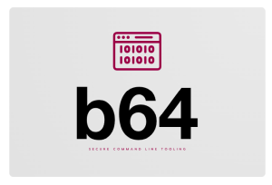

# b64



[](https://github.com/PeterIttner/b64/actions/workflows/dotnet.yml)

Base 64 decode/encode command line util.

*Can either read input from commandline arguments, from command line pipes and from files.*

## Goals of this project

Easy to use base 64 conversion tool to prevent using any online websites for base 64 conversion, which are potentially insecure to use.

## Features

- Base64 Encoding / Decoding
- Base64 Url Encoding / Decoding
- Input via
  - File
  - stdin / pipes
  - Parameter
- JWT Decoding
- Completly offline - without web access (no data leaks)

## Upcoming Features

- Basic Auth Encoding / Decoding
- Kubernetes Secret Encoding / Decoding

## Contribution

As this is mainly a personal utility program do not expect many changes in the future.
Feel free to contribute via pull-requests or submit issues if any. Please note, that there might be a quite long response time as I don't know how much I will invest in this small tool in the future.

## Requirements

[dotnetcore 9.0 runtime/sdk](https://dotnet.microsoft.com/download/dotnet-core/9.0)

## Build

```bash
dotnet restore .
dotnet build . -c Release
```

## Tests

```bash
./tests.sh && echo "TESTS OK" || echo "TESTS FAILED"
```

## Installation

`dotnet tool install --global b64`

## Example usages

Display Help:

```bash
b64 --help
```

Encode a ASCII text as base 64 ASCII text:

```bash
b64 encode Hello
b64 encode -f hello.txt
b64 encode < hello.txt
cat hello.txt | b64 encode
```

Decode a base64 ASCII text to regular ASCII text:

```bash
b64 decode SGVsbG8=
b64 decode -f hello.txt
b64 decode < hello.txt
cat hello.txt | b64 decode
```